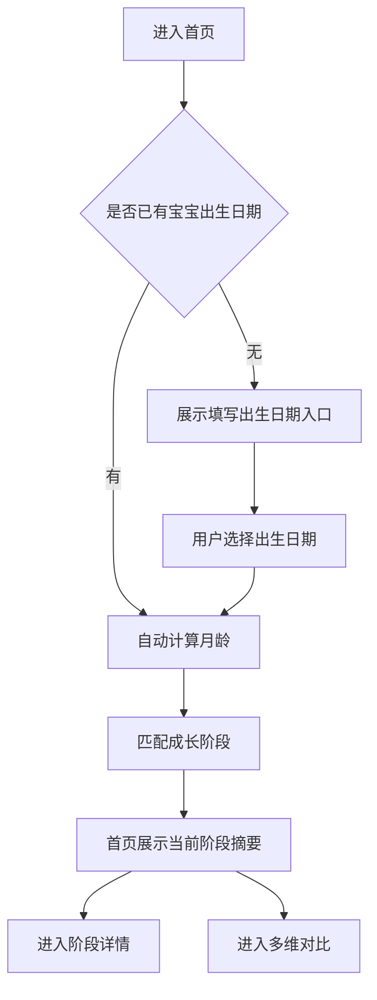
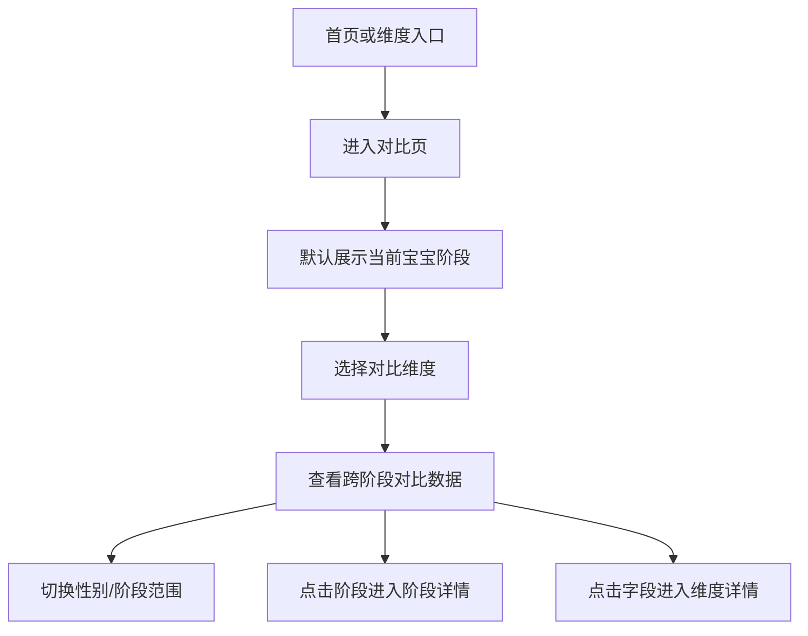

# 0-3岁成长发育 H5 UE 稿 v1.0

## 1. 文档信息

| 项目 | 内容 |
| --- | --- |
| 产品名称 | 0-3岁成长发育 H5 |
| UE 版本 | v1.0 |
| 对应 PRD | [PRD-v1.1.md](./PRD-v1.1.md) |
| 设计目标 | 跑通“当前月龄自动匹配阶段”和“多维度跨阶段对比”两条核心路径 |
| 目标端 | 移动端 H5，优先适配微信内访问 |

## 2. UE 设计原则

- 首页优先回答“我的宝宝现在处于哪个阶段”。
- 对比页优先回答“不同阶段在这个维度上有什么变化”。
- 所有页面都要保留阶段上下文，避免用户迷失在维度信息里。
- 生长指标只展示参考范围，不输出诊断式结论。
- 默认路径尽量短，出生日期输入不是强制门槛，用户仍可手动选择阶段。

## 3. 核心用户路径

### 3.1 路径 A：自动匹配当前阶段



### 3.2 路径 B：多维度跨阶段对比



## 4. 信息架构

### 4.1 MVP 页面结构

| 层级 | 页面 | 作用 |
| --- | --- | --- |
| 一级 | 首页 | 当前阶段摘要、出生日期入口、对比入口 |
| 一级 | 阶段列表 | 手动选择或切换阶段 |
| 一级 | 多维对比 | 按维度查看跨阶段数据 |
| 二级 | 阶段详情 | 查看某一阶段完整内容 |
| 二级 | 维度详情 | 查看某一维度在各阶段的说明 |
| 辅助 | 宝宝信息面板 | 录入出生日期、性别、昵称 |
| 辅助 | 数据说明 | 来源、版本、免责声明 |

### 4.2 推荐导航

MVP 推荐使用底部 3 个主入口，减少 App 化负担。

| 导航 | 文案 | 默认图标含义 | 说明 |
| --- | --- | --- | --- |
| 首页 | 首页 | home | 当前阶段摘要 |
| 对比 | 对比 | chart/table | 跨阶段多维对比 |
| 阶段 | 阶段 | calendar/list | 手动浏览阶段 |

页面右上角或底部辅助区保留“数据说明”入口。宝宝信息入口放在首页当前阶段卡片内，不单独作为主导航。

## 5. 页面 UE

### 5.1 首页

#### 页面目标

- 让用户一眼知道宝宝当前月龄和对应阶段。
- 给出当前阶段最重要的核心数据。
- 提供进入“阶段详情”和“跨阶段对比”的主要入口。

#### 页面结构

```text
┌────────────────────────────┐
│ 0-3岁成长发育        数据说明 │
├────────────────────────────┤
│ 当前宝宝阶段卡片             │
│ - 小树苗 · 10个月5天         │
│ - 匹配阶段：10-12个月        │
│ - 出生日期 / 修改            │
│ - 手动切换阶段               │
├────────────────────────────┤
│ 核心指标摘要                 │
│ ┌ 体重 ┐ ┌ 身高 ┐ ┌ 头围 ┐   │
│ │男/女参考范围 + 单位       │
│ └─────┘ └─────┘ └─────┘   │
├────────────────────────────┤
│ 今日重点                     │
│ - 睡眠/喂养/发育/医疗保健    │
├────────────────────────────┤
│ 主操作                       │
│ [查看阶段详情] [多维度对比]  │
├────────────────────────────┤
│ 医疗参考提示                 │
└────────────────────────────┘
```

#### 关键交互

| 触发 | 行为 |
| --- | --- |
| 点击出生日期/修改 | 打开宝宝信息面板 |
| 点击手动切换阶段 | 进入阶段列表或打开阶段选择浮层 |
| 点击体重/身高/头围卡片 | 进入对应维度对比页，默认高亮当前阶段 |
| 点击查看阶段详情 | 进入当前阶段详情 |
| 点击多维度对比 | 进入对比首页 |
| 点击数据说明 | 进入数据说明页 |

#### 状态

| 状态 | 展示 |
| --- | --- |
| 无宝宝信息 | 展示“填写出生日期，自动匹配阶段”入口，同时显示默认阶段选择 |
| 已匹配阶段 | 展示宝宝月龄、匹配阶段、当前阶段摘要 |
| 出生日期超范围 | 提示“本工具适用于 0-3 岁宝宝参考”，保留手动选阶段入口 |
| 指标缺失 | 指标卡展示“暂无具体范围，仅提供增长趋势/建议” |

## 5.2 宝宝信息面板

#### 页面目标

- 低成本录入出生日期。
- 不强迫用户填写完整资料。
- 用最少字段完成阶段匹配。

#### 页面结构

```text
┌────────────────────────────┐
│ 宝宝信息                 关闭 │
├────────────────────────────┤
│ 昵称（选填）                 │
│ [小树苗________________]     │
│ 出生日期（必填）             │
│ [2025-06-20____________]     │
│ 性别（用于指标展示）         │
│ [全部] [男孩] [女孩]         │
├────────────────────────────┤
│ 本地保存开关                 │
│ [开启] 下次访问自动匹配      │
├────────────────────────────┤
│ [保存并匹配阶段]             │
└────────────────────────────┘
```

#### 字段规则

| 字段 | 是否必填 | 规则 |
| --- | --- | --- |
| 昵称 | 否 | 最多 12 个字符 |
| 出生日期 | 是 | 不能晚于今天，不能早于 3 年前太多 |
| 性别 | 否 | 默认“全部”，选择男孩/女孩后影响生长指标展示 |
| 本地保存 | 否 | 默认开启，说明仅保存在当前设备 |

#### 保存后反馈

- 若匹配成功，关闭面板并刷新首页当前阶段卡片。
- 若超出范围，展示错误提示，不关闭面板。
- 若用户未填写出生日期，保存按钮置灰或提交时提示。

## 5.3 阶段列表

#### 页面目标

- 支持不填写出生日期的用户手动选择阶段。
- 支持用户修正自动匹配结果。
- 为跨阶段对比提供阶段认知。

#### 页面结构

```text
┌────────────────────────────┐
│ 阶段                       │
├────────────────────────────┤
│ 当前匹配：10-12个月          │
│ [重新填写出生日期]           │
├────────────────────────────┤
│ 0-42天                      │
│ 42天-3个月                  │
│ 4-6个月                     │
│ 7-9个月                     │
│ 10-12个月      当前宝宝       │
│ 13-18个月                   │
│ 19-24个月                   │
│ 25-30个月                   │
│ 31-36个月                   │
├────────────────────────────┤
│ [查看该阶段详情]             │
└────────────────────────────┘
```

#### 关键交互

| 触发 | 行为 |
| --- | --- |
| 点击阶段 | 选中该阶段，底部按钮可用 |
| 点击当前宝宝阶段 | 进入当前阶段详情 |
| 点击重新填写出生日期 | 打开宝宝信息面板 |
| 点击查看该阶段详情 | 进入阶段详情 |

## 5.4 多维对比首页

#### 页面目标

- 让用户选择“要对比什么”。
- 默认围绕当前宝宝阶段组织信息。
- 快速进入具体维度的跨阶段对比。

#### 页面结构

```text
┌────────────────────────────┐
│ 多维对比              筛选   │
├────────────────────────────┤
│ 当前宝宝：10个月5天           │
│ 当前阶段：10-12个月           │
│ 对比范围：[相邻阶段] [全部]   │
├────────────────────────────┤
│ 生长指标                     │
│ [体重] [身高] [头围]          │
├────────────────────────────┤
│ 日常照护                     │
│ [睡眠] [喂养] [排便]          │
├────────────────────────────┤
│ 发育表现                     │
│ [动作] [语言] [认知] [情绪]   │
├────────────────────────────┤
│ 医疗保健                     │
│ [疫苗] [体检] [警示信号]      │
└────────────────────────────┘
```

#### 默认策略

| 场景 | 默认值 |
| --- | --- |
| 已有宝宝出生日期 | 当前阶段高亮，对比范围默认“相邻阶段” |
| 无宝宝出生日期 | 默认选中用户最近选择阶段；若无，则默认 10-12 个月或第一个阶段 |
| 已选择性别 | 生长指标按该性别展示，同时保留切换 |
| 未选择性别 | 生长指标展示男/女双列或“全部” |

## 5.5 维度对比详情

#### 页面目标

- 在一个维度下横向比较不同阶段数据。
- 让用户明确看到当前宝宝阶段处于整体序列中的位置。
- 支持从对比结果回到阶段详情或维度详情。

#### 页面结构：生长指标类

```text
┌────────────────────────────┐
│ 体重对比              说明   │
├────────────────────────────┤
│ 维度切换：[体重][身高][头围]  │
│ 性别：[全部][男孩][女孩]      │
│ 范围：[相邻阶段][全部阶段]    │
├────────────────────────────┤
│ 阶段        男孩       女孩   │
│ 0-42天      2.6-4.4   2.4-4.2│
│ 42天-3月    3.6-6.0   3.3-5.4│
│ 4-6月       仅增长速度        │
│ 7-9月       仅增长速度        │
│ 10-12月 ★   7.7-11.5  7.2-10.8│
│ 13-18月     8.6-12.6  7.9-11.8│
├────────────────────────────┤
│ ★ 当前宝宝阶段               │
│ 数据仅供参考，个体差异较大。 │
└────────────────────────────┘
```

#### 页面结构：文本建议类

```text
┌────────────────────────────┐
│ 睡眠对比              说明   │
├────────────────────────────┤
│ 维度切换：[睡眠][喂养][发育]  │
│ 范围：[相邻阶段][全部阶段]    │
├────────────────────────────┤
│ 0-42天                      │
│ 13-18小时，暂无昼夜节律       │
│ 来源：页 4                   │
├────────────────────────────┤
│ 4-6个月                     │
│ 12-16小时，白天3-4次小睡      │
│ 来源：页 6                   │
├────────────────────────────┤
│ 10-12个月 ★                 │
│ 12-16小时，白天约2次小睡      │
│ 来源：页 11                  │
├────────────────────────────┤
│ [查看10-12个月阶段详情]       │
└────────────────────────────┘
```

#### 关键交互

| 触发 | 行为 |
| --- | --- |
| 切换维度 | 当前页面刷新为新维度对比数据 |
| 切换性别 | 生长指标表格按选择过滤 |
| 切换范围 | 相邻阶段和全部阶段之间切换 |
| 点击阶段行 | 进入该阶段详情 |
| 点击来源/说明 | 打开数据说明或来源说明 |
| 点击图表说明 | 打开说明弹层，解释颜色、单位、缺失数据 |

#### 对比范围规则

| 范围 | 说明 |
| --- | --- |
| 相邻阶段 | 当前阶段前后各 1-2 个阶段，用于快速理解附近变化 |
| 全部阶段 | 0-3 岁全部阶段，用于查看完整趋势 |
| 自定义阶段 | P1，可多选阶段范围 |

## 5.6 阶段详情

#### 页面目标

- 承接自动匹配结果，展示当前阶段完整信息。
- 提供回到对比页的入口。

#### 页面结构

```text
┌────────────────────────────┐
│ 10-12个月              对比   │
├────────────────────────────┤
│ 阶段摘要                     │
│ - 当前宝宝：10个月5天         │
│ - 距离下一阶段约1个月25天     │
├────────────────────────────┤
│ 生长指标                     │
│ 体重 / 身高 / 头围             │
│ [与其他阶段对比]              │
├────────────────────────────┤
│ 营养喂养                     │
│ 辅食添加、乳量建议、营养剂     │
├────────────────────────────┤
│ 发育表现                     │
│ 动作、语言、认知、情绪社会性   │
├────────────────────────────┤
│ 医疗保健                     │
│ 疫苗、体检、警示信号           │
├────────────────────────────┤
│ 数据来源与免责声明            │
└────────────────────────────┘
```

#### 关键交互

| 触发 | 行为 |
| --- | --- |
| 点击顶部对比 | 进入多维对比页，默认阶段为当前阶段 |
| 点击某个指标的对比入口 | 进入对应维度对比详情 |
| 点击分组标题 | 展开/收起分组 |
| 点击来源 | 打开数据说明或来源详情 |

## 5.7 维度详情

#### 页面目标

- 展示单个维度下的详细解释。
- 和维度对比详情形成互补：对比页看横向差异，详情页看具体说明。

#### 页面结构

```text
┌────────────────────────────┐
│ 头围                         │
├────────────────────────────┤
│ 当前阶段：10-12个月           │
│ 男孩参考：42.7-47.7cm         │
│ 女孩参考：41.6-46.5cm         │
├────────────────────────────┤
│ [查看跨阶段对比]              │
├────────────────────────────┤
│ 说明                         │
│ - 参考范围含义                │
│ - 数据缺失说明                │
│ - 个体差异提示                │
├────────────────────────────┤
│ 来源与更新时间                │
└────────────────────────────┘
```

## 5.8 数据说明页

#### 页面目标

- 解释数据来源、版本和适用范围。
- 明确医疗安全边界。

#### 页面结构

```text
┌────────────────────────────┐
│ 数据说明                     │
├────────────────────────────┤
│ 数据来源                     │
│ - 来源名称                   │
│ - 版本/发布日期              │
├────────────────────────────┤
│ 当前数据版本                 │
│ - v1.0.0                     │
│ - 更新时间                   │
├────────────────────────────┤
│ 适用范围                     │
│ - 0-3岁儿童成长发育参考       │
├────────────────────────────┤
│ 免责声明                     │
│ - 仅供参考                   │
│ - 不替代医生诊断             │
│ - 疫苗/体检以当地机构为准     │
└────────────────────────────┘
```

## 6. 关键组件

### 6.1 当前阶段卡片

| 元素 | 内容 |
| --- | --- |
| 宝宝信息 | 昵称、月龄、性别 |
| 阶段信息 | 阶段名称、阶段范围、距离下一阶段 |
| 操作 | 修改出生日期、手动切换阶段 |
| 状态 | 已匹配、未匹配、超范围 |

### 6.2 指标卡片

| 元素 | 内容 |
| --- | --- |
| 指标名 | 体重、身高、头围 |
| 单位 | kg、cm |
| 参考范围 | 男孩、女孩或全部 |
| 操作 | 查看对比、查看详情 |
| 提示 | 来源、缺失说明、个体差异 |

### 6.3 对比表格

| 元素 | 内容 |
| --- | --- |
| 行 | 阶段 |
| 列 | 性别、数值范围、说明 |
| 高亮 | 当前宝宝阶段 |
| 筛选 | 性别、阶段范围、维度 |
| 空值 | 缺失说明，不留空 |

### 6.4 维度选择器

| 分类 | 维度 |
| --- | --- |
| 生长指标 | 体重、身高、头围 |
| 日常照护 | 睡眠、喂养、排便 |
| 发育表现 | 动作、语言、认知、情绪社会性 |
| 医疗保健 | 疫苗、体检、警示信号 |

## 7. 交互状态

| 状态 | 页面 | UE 处理 |
| --- | --- | --- |
| 首次访问 | 首页 | 展示出生日期入口和手动选阶段入口 |
| 已保存宝宝信息 | 首页、对比页 | 自动高亮当前阶段 |
| 未选择性别 | 对比详情 | 生长指标展示男/女双列 |
| 已选择性别 | 对比详情 | 默认按所选性别展示，可切换全部 |
| 数据缺失 | 指标卡、对比表 | 展示“暂无具体范围，仅提供增长趋势/建议” |
| 加载失败 | 全局 | 提供重试和返回首页 |
| 超出适用年龄 | 宝宝信息面板、首页 | 提示适用范围，仍允许手动浏览 |

## 8. 文案口径

### 8.1 推荐文案

| 场景 | 文案 |
| --- | --- |
| 出生日期入口 | 填写宝宝出生日期，自动匹配当前成长阶段 |
| 当前阶段 | 当前匹配阶段：10-12个月 |
| 对比入口 | 查看不同阶段的变化 |
| 当前阶段高亮 | 当前宝宝阶段 |
| 数据提示 | 本数据为参考范围，个体差异较大 |
| 缺失数据 | 当前阶段暂无具体范围，仅提供趋势或建议 |
| 医疗提示 | 如有持续担忧，请咨询专业医生 |

### 8.2 禁用文案

| 禁用表达 | 替代表达 |
| --- | --- |
| 正常/异常 | 参考范围内/需结合个体情况判断 |
| 偏高/偏低 | 高于/低于参考范围 |
| 发育迟缓 | 建议咨询专业医生 |
| 必须接种 | 接种安排以当地接种单位为准 |
| 应该治疗 | 如有疑问请咨询医生 |

## 9. MVP 走查清单

- 首页首次访问时，不填写宝宝信息也能继续浏览。
- 填写出生日期后，首页能自动刷新为当前阶段。
- 当前阶段卡片能清楚展示月龄、阶段和修改入口。
- 首页至少提供“阶段详情”和“多维对比”两个主操作。
- 对比页默认高亮当前宝宝阶段。
- 体重、身高、头围能跨阶段对比。
- 睡眠、喂养、发育能跨阶段对比。
- 对比详情可切换性别和对比范围。
- 阶段详情可回到对应维度对比。
- 维度详情可进入跨阶段对比。
- 数据缺失有解释，不能留空。
- 所有核心页面都有医疗参考提示或可达的数据说明入口。

## 10. 后续版本 UE 预留

| 版本 | 预留能力 | UE 入口建议 |
| --- | --- | --- |
| v1.1 | 搜索 | 首页顶部搜索框或对比页内搜索 |
| v1.1 | 反馈 | 来源说明、数据说明、指标详情底部入口 |
| v1.1 | 自定义筛选 | 对比页筛选面板 |
| v1.2 | 成长卡 | 阶段详情顶部或底部主按钮 |
| v1.2 | 分享海报 | 成长卡详情页 |
| v1.3 | 反馈记录 | 轻量“我的”页面或数据说明页入口 |

