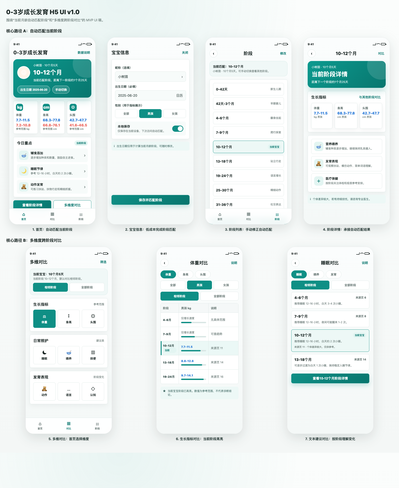
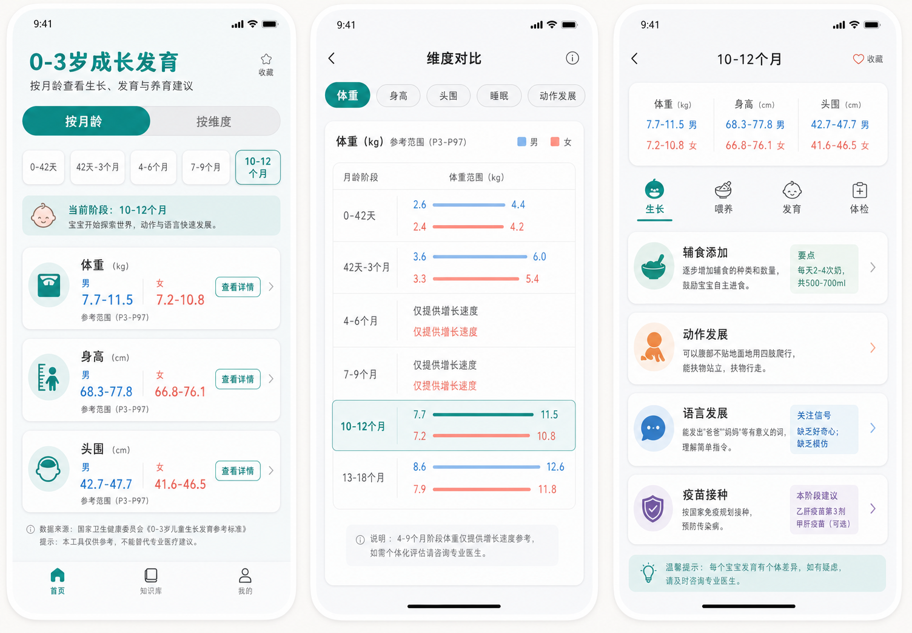
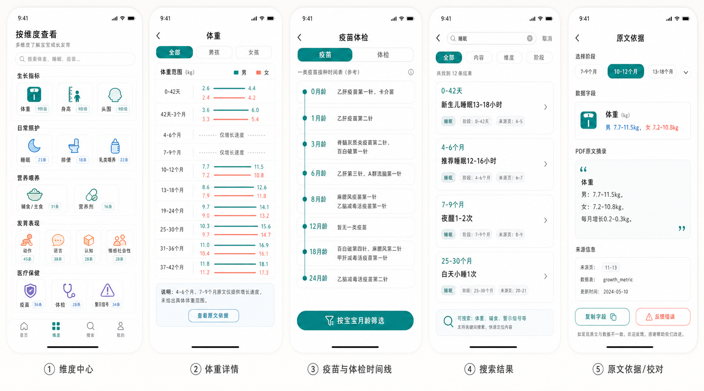
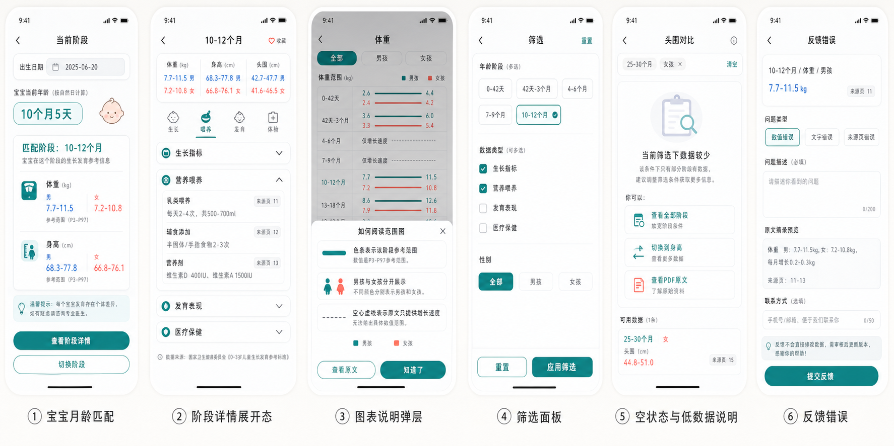
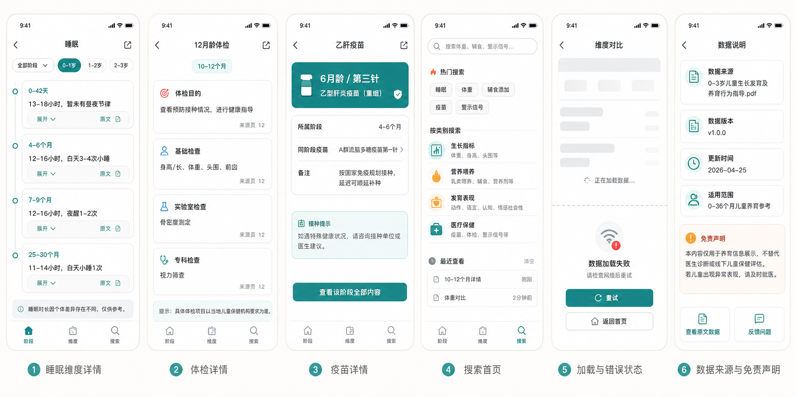
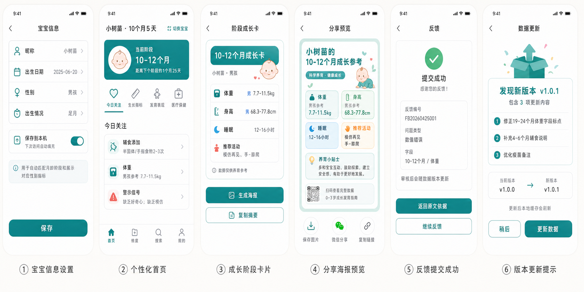

# H5 UI Mockups

本目录保存当前聊天生成的 H5 UI 图。图片统一使用相对路径引用，方便在项目文档、GitHub 预览和本地 Markdown 工具中直接查看。

完整页面结构、路由清单和 API 设计原参考 `h5-ui-routes.md`。本文件主要用于把设计图和当前前端实现对齐，作为 UI 走查、开发拆分和验收入口。

## 使用口径

- `设计图`：用于确认页面布局、模块层级和交互状态。
- `对应路由`：来自历史路由设计和当前 `src/router/index.ts`。
- `当前状态`：基于当前前端路由做的整理，不代表所有视觉细节都已完全还原。
- `待确认`：设计图中出现，但当前没有独立路由或需要继续验收的功能点。

## 总览

| 文件 | 设计主题 | 对应路由 | 当前状态 | 备注 |
| --- | --- | --- | --- | --- |
| [ui-v1.0.html](./ui-v1.0.html) / [ui-v1.0.png](./assets/ui-v1.0.png) | UE v1.0 对应 UI：自动匹配当前阶段、多维度跨阶段对比 | `/`, `/baby/settings`, `/stages`, `/stages/:stageId`, `/compare`, `/compare/:dimensionKey` | 最新 UI 稿 | 基于 [UE-v1.0.md](./UE-v1.0.md) 生成，优先覆盖 MVP 核心路径。 |
| [01-core-flow.png](./assets/01-core-flow.png) | 核心流程：阶段总览、维度对比、阶段详情 | `/`, `/stages`, `/stages/:stageId`, `/dimensions/growth/:metricKey` | 已有主要路由 | 用于检查 H5 的主路径是否顺畅。 |
| [02-extended-pages.png](./assets/02-extended-pages.png) | 扩展页面：维度中心、体重详情、疫苗体检、搜索、原文依据 | `/dimensions`, `/dimensions/growth/:metricKey`, `/medical/vaccines`, `/medical/checkups`, `/search`, `/search/results`, `/source/:stageId` | 已有主要路由 | 搜索首页和搜索结果已有独立路由，需继续验收结果页的数据、空状态和返回路径。 |
| [03-interaction-states.png](./assets/03-interaction-states.png) | 交互细节：月龄匹配、折叠展开、图表说明、筛选、空状态、反馈 | `/`, `/stages/:stageId`, `/dimensions/growth/:metricKey`, `/dimensions/text/:category`, `/feedback/new` | 部分落地 | 适合做交互状态验收，尤其是加载、空数据、筛选和反馈入口。 |
| [04-missing-pages.png](./assets/04-missing-pages.png) | 补齐页面：睡眠维度、体检详情、疫苗详情、搜索首页、加载错误、数据说明 | `/dimensions/text/:category`, `/medical/checkups/:id`, `/medical/vaccines/:id`, `/search`, `/about/data` | 大部分已有路由 | 加载错误属于通用页面状态，需要结合具体页面再验收。 |
| [05-personalization-sharing.png](./assets/05-personalization-sharing.png) | 个性化与传播：宝宝设置、个人化首页、成长卡、分享海报、反馈成功、版本更新 | `/baby/settings`, `/`, `/stages/:stageId/card`, `/feedback/records`, `/feedback/success`, `/about/data`, `/data/update` | 部分落地 | 成长卡、反馈记录和版本更新已有路由；分享海报的图片生成、长按保存和分享能力仍需验收。 |

## 当前实现差异

以下设计项已经在历史页面与路由设计中出现，并且大多已有前端路由。这里主要记录路由之外仍需确认的实现能力和验收点：

| 设计项 | 设计路由 | 当前处理方式 | 建议 |
| --- | --- | --- | --- |
| 搜索结果 | `/search/results` | 已有独立路由 | 验收关键词透传、结果列表、空状态、返回搜索页和可分享链接。 |
| 数据版本更新 | `/data/update` | 已有独立路由 | 验收版本号、更新时间、变更记录、缓存刷新或重新加载入口。 |
| 反馈记录 | `/feedback/records` | 已有独立路由 | 验收历史反馈列表、状态展示、空状态和服务端查询接口。 |
| 分享海报 | `/stages/:stageId/card` | 已有成长卡页面 | 如果需要图片生成或长按保存，再扩展成长卡页面的导出和分享能力。 |

## 验收重点

- 主流程：从首页进入当前阶段、阶段详情、成长卡、原文依据是否顺畅。
- 维度浏览：体重、身高、头围、睡眠、喂养、发育等维度是否能按阶段查看。
- 医疗保健：疫苗时间线、疫苗详情、体检时间线、体检详情是否完整。
- 搜索反馈：热门搜索、搜索结果、空状态、反馈提交、反馈成功是否闭环。
- 个性化：宝宝信息设置后，首页和成长卡是否能反映宝宝信息。
- 页面状态：加载中、请求失败、空数据、原文缺失、数据不完整需要逐页确认。

## 维护规则

新增或替换设计图时，请同步更新：

1. 将 PNG 文件放在当前目录。
2. 在 `总览` 表中补充设计主题、对应路由和当前状态。
3. 在 `图片预览` 中追加预览。
4. 如果设计引入新页面，同步更新路由设计文档和前端路由。

## 图片预览

### 0. UE v1.0 UI 稿

- HTML 文件：[ui-v1.0.html](./ui-v1.0.html)
- 图片文件：[ui-v1.0.png](./assets/ui-v1.0.png)
- 对应文档：[UE-v1.0.md](./UE-v1.0.md)

### 1. 核心流程

- 图片文件：[01-core-flow.png](./assets/01-core-flow.png)
- 生成时间：`2026-04-25T15:28:30`

### 2. 扩展页面

- 图片文件：[02-extended-pages.png](./assets/02-extended-pages.png)
- 生成时间：`2026-04-25T15:58:40`

### 3. 交互细节

- 图片文件：[03-interaction-states.png](./assets/03-interaction-states.png)
- 生成时间：`2026-04-25T16:09:43`

### 4. 补齐页面

- 图片文件：[04-missing-pages.png](./assets/04-missing-pages.png)
- 生成时间：`2026-04-25T16:14:17`

### 5. 个性化与传播

- 图片文件：[05-personalization-sharing.png](./assets/05-personalization-sharing.png)
- 生成时间：`2026-04-25T16:17:33`

